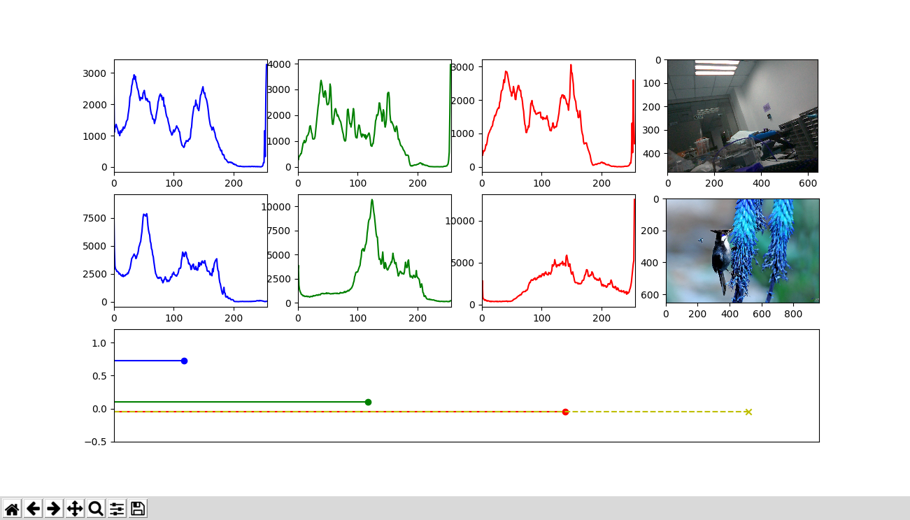

# Camera Relay

在树莓派上安装USB Camera，通过GPIO口控制设备电源，在电源上点一定时间后，对设备进行拍照。

**Ctrl+c**停止程序运行。

目前没有整合图片相似度对比，不过[test/imgcompare.py](test/imgcompare.py)中有`Ubuntu`版本的处理图片相似度源代码，可以用于参考整合功能。下图中，中间一行图最后一张，目前不知道为什么显示的时候偏蓝，不进行任何处理也会这样，所以目前不进行处理：



## 参考文档：
* [Getting Webcam Images with Python and OpenCV 2 (For Real This Time)](https://codeplasma.com/2012/12/03/getting-webcam-images-with-python-and-opencv-2-for-real-this-time/)
* [Python time to String](https://wangheng.org/html/python_datetime.html)
* [Python的命令行参数解析](http://noahsnail.com/2017/09/13/2017-9-13-Python%E7%9A%84%E5%91%BD%E4%BB%A4%E8%A1%8C%E5%8F%82%E6%95%B0%E8%A7%A3%E6%9E%90/)
* [RPi 2B GPIO 测试](http://www.cnblogs.com/zengjfgit/p/5215194.html)
* [RPi 2B python opencv camera demo example](http://www.cnblogs.com/zengjfgit/p/5223747.html)
* [python使用matplotlib:subplot绘制多个子图](http://blog.csdn.net/gatieme/article/details/61416645)
* [直方图计算](http://www.opencv.org.cn/opencvdoc/2.3.2/html/doc/tutorials/imgproc/histograms/histogram_calculation/histogram_calculation.html)
* [Python+OpenCV学习（5）---直方图](http://lib.csdn.net/article/opencv/35685)
* [How-To: 3 Ways to Compare Histograms using OpenCV and Python](https://www.pyimagesearch.com/2014/07/14/3-ways-compare-histograms-using-opencv-python/)

## USAGE

### Help

```
usage: CameraRelay.py [-h] -on ON -off OFF -cap CAP

Camera Control Relay.

optional arguments:
  -h, --help  show this help message and exit
  -on ON      Power On Duty(s)
  -off OFF    Power Off Duty(s)
  -cap CAP    Camera Capture Image Delay After Power On(s)

Example: ./CameraRelay.py -on 4 -off 2 -cap 1
```

### Example

```
./CameraRelay.py -on 4 -off 2 -cap 1 
```

* `System Power On`: 4(s)
* `System Power Off`: 2(s)
* `UsB Camera capture a image after Power On`: 1(s)

### CMD Output Example

```
root@raspberrypi:/home/pi/CameraRelay# ./CameraRelay.py -on 4 -off 2 -cap 1
Namespace(cap='1', off='2', on='4')
 powerOnTime: 4.0.
 powerOffTime: 2.0.
 cameraCaptureDelay: 1.0.

Program Is Running...
Type Ctrl+c to stop the program.
start power off: 20171022072547
over power off and start power on: 20171022072549
capture a image: 20171022072550
over power on: 20171022072553
Capture image count: 1
start power off: 20171022072553
over power off and start power on: 20171022072555
capture a image: 20171022072556
over power on: 20171022072559
Capture image count: 2
start power off: 20171022072559
over power off and start power on: 20171022072602
capture a image: 20171022072603
over power on: 20171022072606
Capture image count: 3
```
